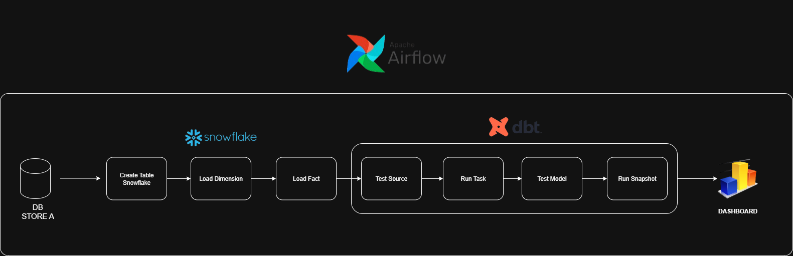
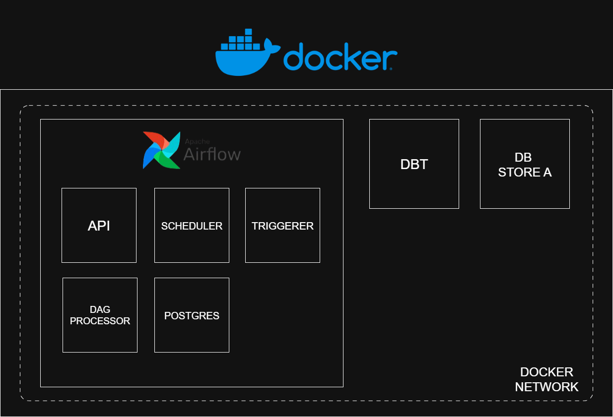
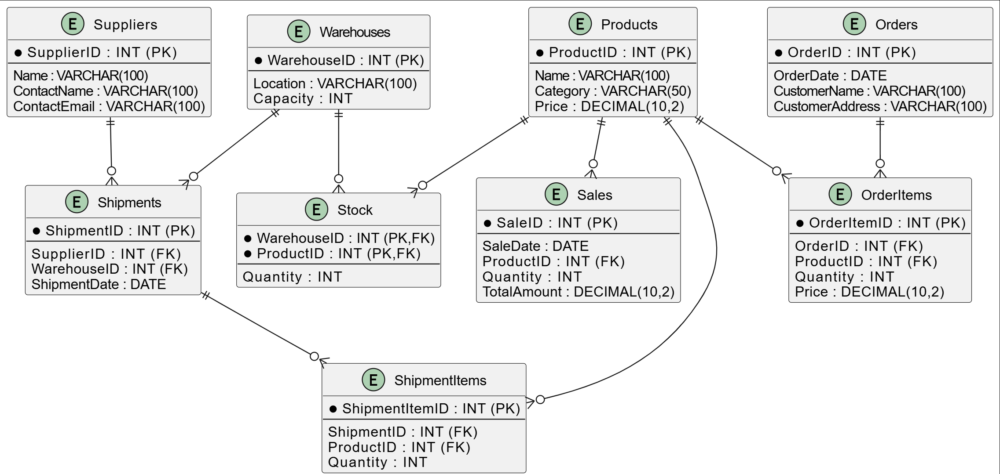
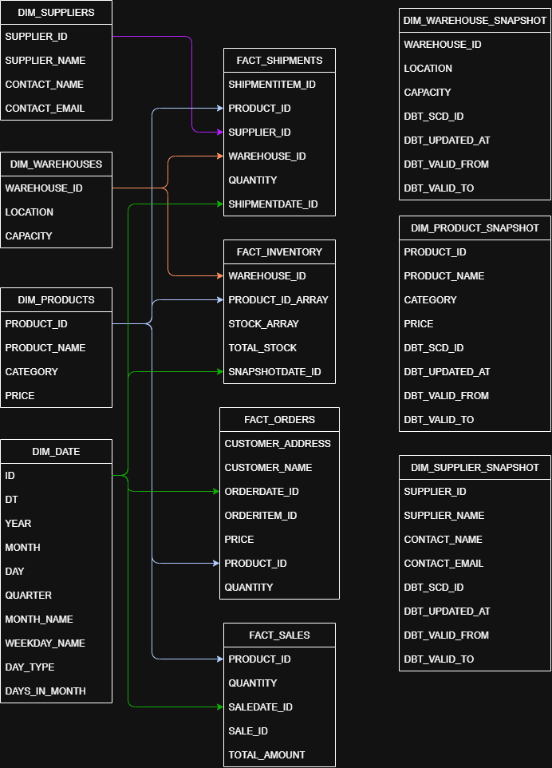

# 📊 Daily Sales Data Pipeline with Airflow, Snowflake, and dbt

An ETL/ELT pipeline for **retail supply chain analytics**, built with:

- **Apache Airflow** → workflow orchestrator  
- **Snowflake** → main data warehouse  
- **dbt (data build tool)** → transformation, snapshotting, testing  
- **MySQL** → operational database as the data source  

---

## 🚀 Key Features
- Automated schema and table creation in Snowflake  
- Extract data from MySQL (dimension & fact tables)  
- Load data into the *landing* schema in Snowflake using **Pandas + SQLAlchemy**  
- Modular pipeline (`extract.py`, `load.py`, `connection.py`, etc.) → easy to maintain  
- Configurable via **Airflow Variables** (`secret_file`, `sql_file`, etc.)  
- **dbt tasks** automatically executed in a single task group:
  - `test_source` → validate sources  
  - `run` → run transformations  
  - `test_model` → test model outputs  
  - `snapshot` → perform snapshotting  

---

## 📂 Project Structure
```bash
.
├── airflow/
│   ├── dags/
│   │   └── daily_sales.py 
│   ├── data_dummy/
│   │   └── store_a.sql
│   ├── include/
│   │   ├── etl/
│   │   │   ├── connection.py 
│   │   │   ├── extract.py 
│   │   │   ├── load.py 
│   │   │   ├── transform.py
│   │   │   └── utils.py 
│   │   └── sql/
│   │       ├── create_schema.sql
│   │       ├── dimension/
│   │       │   ├── products.sql
│   │       │   ├── suppliers.sql
│   │       │   └── warehouses.sql
│   │       └── fact/
│   │           ├── orderitems.sql
│   │           ├── orders.sql
│   │           ├── sales.sql
│   │           ├── shipmentitems.sql
│   │           ├── shipments.sql
│   │           └── stock.sql
│   ├── tests/
│   │   └── dags/
│   │       └── test_dag_example.py
│   ├── .dockerignore
│   ├── airflow_settings.yaml
│   ├── docker-compose.override.yml
│   ├── Dockerfile
│   ├── packages.txt
│   └── requirements.txt
│  
├── dbt/
│   └── my_snowflake_db/
│       ├── analyses/ 
│       ├── macros/
│       │   └── generate_schema_name.sql  
│       ├── models/
│       │   ├── dimension/
│       │   │   ├── dim_date.sql
│       │   │   ├── dim_products.sql
│       │   │   ├── dim_suppliers.sql
│       │   │   └── dim_warehouse.sql
│       │   ├── fact/
│       │   │   ├── fact_inventory.sql
│       │   │   ├── fact_orders.sql
│       │   │   ├── fact_sales.sql
│       │   │   └── fact_shipments.sql
│       │   └── schema_warehouse.yml
│       ├── seeds/
│       ├── snapshots/
│       │   ├── dim_product_snapshot.sql
│       │   ├── dim_supplier_snapshot.sql
│       │   └── dim_warehouse_snapshot.sql
│       ├── tests/
│       │   ├── generic/
│       │   │   ├── test_string_and_set.sql
│       │   │   ├── test_validate_fact_inventory_arrays.sql
│       │   │   └── test_validate_id_date.sql
│       │   └── singular/
│       ├── .gitignore
│       ├── dbt_project.yml
│       ├── package-lock.yml
│       ├── packages.yml
│       └── profiles.yml
│
├── docs/
│   ├── docker_container.png
│   ├── pipeline.png
│   ├── schema_source.png
│   └── schema_warehouse.png
│
├── .gitignore
└── README.md
```
---

## ⚙️ How It Works
- **Airflow DAG** (`daily_sales.py`) orchestrates the pipeline:
    - Creates schemas/tables in Snowflake
    - Extracts data from MySQL
    - Loads raw data into Snowflake (landing schema)
    - Executes dbt tasks for transformation, testing, and snapshotting
- **Configuration** is managed via:
    - Airflow Variables (paths & secrets)
    - .secrets.toml for credentials (not committed to Git)
- **dbt Project** handles transformations and quality checks, ensuring data is production-ready.

---

## 🛠️ Tech Stack

- Airflow `2.x`
- Snowflake
- dbt Core `1.x`
- MySQL
- Python `3.9+`
- Pandas + SQLAlchemy

---

## 📊 Pipeline, Database & BI Overview

**Pipeline Flow:**  


**Docker Container Architecture:**  


**Source Schema (MySQL)**


**Warehouse Schema (Snowflake)**


**Dashboard:**  
This shows sample visualizations based on the data loaded into Snowflake and transformed via dbt.  


---

## 🗄️ Data Modeling

This project follows a Kimball-style dimensional modeling approach:

- **Source Schema (MySQL)**
Contains operational data from the retail system. Includes both master data and transactions:
  - `products`, `suppliers`, `warehouses`, `customers`
  - `orders`, `order_items`, `shipments`, `inventory`, `sales`

- **Warehouse Schema (Snowflake)**
Modeled into dimensions and facts for analytics:

  - Dimensions
    - `dim_date` → calendar table
    - `dim_products`, `dim_suppliers`, `dim_warehouse` → master entities

  - Facts
    - `fact_orders` → customer order records
    - `fact_sales` → sales transactions
    - `fact_shipments` → logistics and delivery
    - `fact_inventory` → stock levels by warehouse and product

  - Snapshots (dbt)
  Track historical changes of slowly changing dimensions (SCD Type 2):
    - `dim_product_snapshot` → track product detail changes (e.g., category, price)
    - `dim_supplier_snapshot` → track supplier info changes
    - `dim_warehouse_snapshot` → track warehouse attributes

---

## 🔑 Portfolio Highlights

- Demonstrates end-to-end retail data pipeline
- Shows integration of Airflow, Snowflake, dbt, and Python ETL scripts
- Includes modular ETL, snapshotting, and automated data quality testing
- Fully documented and ready to showcase on GitHub

---

## ⚙️ Setup & Installation

Follow these steps to run the Daily Sales Data Pipeline locally using Docker and Astronomer (Astro CLI).

**1️⃣ Install Docker**
Download and install Docker Desktop based on your operating system:

- Windows/Mac:
👉 https://www.docker.com/products/docker-desktop/

- Linux (Ubuntu):
```bash
sudo apt update
sudo apt install docker.io docker-compose -y
sudo systemctl enable --now docker
```
✅ Verify your installation:
```bash
docker ps
```

**2️⃣ Install Astro CLI**

Astro CLI is used to manage and run Apache Airflow locally with Docker.

Install via the official script:
```bash
curl -sSL https://install.astronomer.io | bash
```
Confirm that Astro is successfully installed:
```bash
astro version
```

**3️⃣ Pull Required Docker Images**

This project relies on the following Docker images:

  - **ghcr.io/dbt-labs/dbt-snowflake** → runs dbt transformations
  - **mysql:8.0.42-debian** → serves as the operational (source) database
  - **Airflow image** → automatically provided by Astronomer

Pull the images manually:
```bash
docker pull ghcr.io/dbt-labs/dbt-snowflake
docker pull mysql:8.0.42-debian
```
⚠️ The Airflow image is automatically handled by Astronomer when running ```astro dev start```.

**4️⃣ (Optional) Initialize an Astro Project**

If you haven’t initialized an Airflow project yet, run:
```bash
astro dev init
```
This command creates the necessary project structure and default configuration files for Astronomer.

**5️⃣ Configure Snowflake Credentials →** ```profiles.yml```

Update your Snowflake account credentials in:
```dbt/my_snowflake_db/profiles.yml```

Example:
```bash
my_snowflake_db:
  target: dev
  outputs:
    dev:
      type: snowflake
      account: <your_account>
      user: <your_username>
      password: <your_password>
      role: <your_role>
      database: RETAIL_SUPPLY_CHAIN
      warehouse: COMPUTE_WH
      schema: ANALYTICS
      threads: 4
      client_session_keep_alive: False
```

🔒 Important: Do not commit this file to GitHub since it contains your Snowflake credentials.

**6️⃣ Configure Airflow Connections →** ```airflow_settings.yml```

Set up your Snowflake and MySQL connections in:
```airflow/airflow_settings.yml```

Example:
```bash
connections:
  - conn_id: snowflake_conn
    conn_type: snowflake
    conn_login: <your_username>
    conn_password: <your_password>
    conn_schema: ANALYTICS
    conn_extra:
      account: <your_account>
      warehouse: COMPUTE_WH
      database: RETAIL_SUPPLY_CHAIN
      role: <your_role>

  - conn_id: mysql_source
    conn_type: mysql
    conn_host: mysql
    conn_schema: retail_supply_chain
    conn_login: root
    conn_password: root
    conn_port: 3306
```

**7️⃣ Start the Local Environment**

Spin up the entire local stack (Airflow, MySQL, and dbt containers) with:
```bash
astro dev start
```

⏱️ Wait a few minutes for all containers to fully initialize.

Check that the containers are running:
```bash
docker ps
```

**8️⃣ Import Airflow Connections and Variables**

Once the containers are up, import the pre-configured Airflow settings (connections, variables, etc.) from the file ```airflow_settings.yaml```:
```bash
astro dev object import
```
✅ This automatically configures your Airflow environment with:
  - Snowflake connection
  - MySQL connection
  - Variables like secret_file, sql_file, and others

**🔟 Access the Airflow Web UI**

Once Airflow is up and running, open:
```bash
http://localhost:8080
```

Default credentials (Astro):
```bash
Username: admin
Password: admin
```

After logging in, locate the DAG named daily_sales and unpause it to start the workflow.

**9️⃣ (Optional) Load Sample Data into MySQL**

To populate the MySQL database with sample data for testing:
```bash
docker exec -i <mysql_container_name> mysql -uroot -proot retail_supply_chain < airflow/data_dummy/store_a.sql
```

✅ Done!

Your pipeline will now automatically:

  - Create schemas and tables in Snowflake
  - Extract data from MySQL
  - Load raw data into the landing schema
  - Run dbt transformations and snapshots
  - Perform dbt model testing

⚡ Quick Summary (Cheat Sheet)
```bash 
# 1. Install Docker & Astro CLI
# 2. Pull required images
docker pull mysql:8.0.42-debian
docker pull ghcr.io/dbt-labs/dbt-snowflake

# 3. Configure credentials
# - dbt/my_snowflake_db/profiles.yml
# - airflow/airflow_settings.yml

# 4. Start the environment
astro dev start

# 5. Open Airflow UI
http://localhost:8080
```
